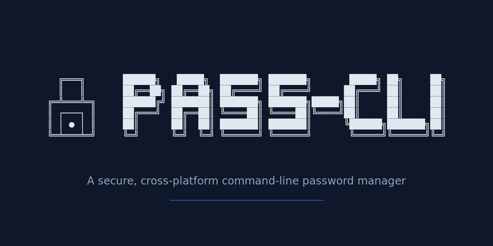
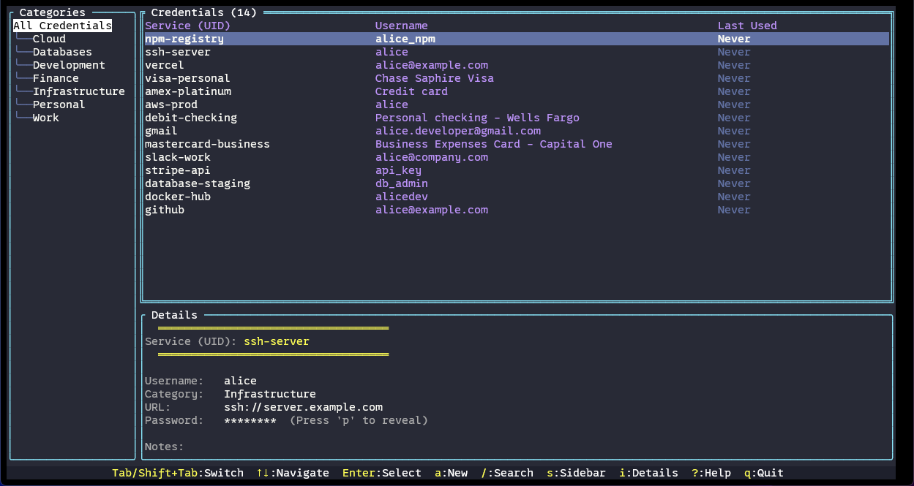

<p align="center">
  
</p>

<p align="center">
  <strong>A secure, cross-platform command-line password manager designed for developers</strong>
</p>

<p align="center">
  
  
</p>

Pass-CLI is a fast, secure password and API key manager that stores credentials locally with AES-256-GCM encryption. Built for developers who need quick, script-friendly access to credentials without cloud dependencies.

📚 **[View Full Documentation](https://arimxyer.github.io/pass-cli/)** | [Getting Started](docs/01-getting-started/quick-start.md) | [Installation](docs/01-getting-started/quick-install.md) | [Usage Guide](docs/03-reference/command-reference.md)

## Key Features

- **Military-Grade Encryption**: AES-256-GCM with hardened PBKDF2 key derivation (600,000 iterations)
- **BIP39 Recovery Phrase**: 24-word recovery phrase for vault password reset (industry-standard mnemonic)
- **System Keychain Integration**: Windows Credential Manager, macOS Keychain, Linux Secret Service
- **Password Policy Enforcement**: Complexity requirements for vault and credential passwords
- **Vault Backup & Restore**: Manual backups with integrity verification and automatic backup during vault operations
- **Tamper-Evident Audit Logging**: Optional HMAC-signed audit trail for vault operations
- **Health Checks**: Built-in `doctor` command for vault verification and troubleshooting
- **Cross-Platform**: Single binary for Windows, macOS (Intel/ARM), and Linux (amd64/arm64)
- **Script-Friendly**: Clean output modes (`--quiet`, `--field`, `--masked`) for shell integration
- **Usage Tracking**: Automatic tracking of where credentials are used across projects
- **Local-First**: Works offline by default, optional cloud sync via rclone
- **Cloud Sync**: Sync vault across devices with rclone (Google Drive, Dropbox, OneDrive, S3, etc.)
- **Interactive TUI**: Terminal UI for visual credential management
- **TOTP / 2FA Support**: Store TOTP secrets and generate 6-digit codes - no separate authenticator app needed

## Quick Start

### Installation

**macOS / Linux (Homebrew)**:
```bash
brew tap arimxyer/homebrew-tap
brew install pass-cli
```

**Windows (Scoop)**:
```powershell
scoop bucket add arimxyer https://github.com/arimxyer/scoop-bucket
scoop install pass-cli
```

For manual installation and other methods, see [docs/01-getting-started/manual-install.md](docs/01-getting-started/manual-install.md).

### Getting Started

```bash
# Initialize vault (choose: new vault or connect to synced vault)
pass-cli init

# Add your first credential
pass-cli add github
# Enter username and password when prompted

# Retrieve a credential
pass-cli get github

# List all credentials
pass-cli list

# Use in scripts (quiet mode)
export API_KEY=$(pass-cli get myservice --quiet --field password)
```

For detailed usage and examples, see [docs/01-getting-started/quick-start.md](docs/01-getting-started/quick-start.md).

## Interactive TUI Mode

Pass-CLI includes a Terminal User Interface for visual credential management:



```bash
# Launch TUI mode (no arguments)
pass-cli

# CLI commands work with explicit subcommands
pass-cli list
```

**Key Features**:
- Visual navigation with arrow keys and Tab
- Interactive forms for adding/editing credentials
- Password visibility toggle with `p` (or `Ctrl+P` in forms)
- Search and filter with `/`
- Customizable keyboard shortcuts
- Responsive layout (requires 60x30 minimum terminal size)

Press `?` in TUI mode to see all keyboard shortcuts. For complete TUI documentation and configuration, see [docs/03-reference/command-reference.md](docs/03-reference/command-reference.md).

## Core Commands

```bash
# Initialize vault
pass-cli init

# Add credential
pass-cli add github --url https://github.com --notes "Personal account"

# Get credential (formatted display)
pass-cli get github

# Get credential (script-friendly)
pass-cli get github --quiet --field password

# List all credentials
pass-cli list

# Update credential
pass-cli update github --username newuser@example.com

# Delete credential
pass-cli delete github

# Generate password
pass-cli generate --length 32

# Remove vault
pass-cli vault remove

# Create manual vault backup
pass-cli vault backup create

# Preview backup contents (without restoring)
pass-cli vault backup preview --file vault.enc.backup

# Restore vault from backup
pass-cli vault backup restore

# View backup status
pass-cli vault backup info

# Enable cloud sync (on existing vault)
pass-cli sync enable

# Health check (includes sync status)
pass-cli doctor
```

For complete command reference, flags, and examples, see [docs/03-reference/command-reference.md](docs/03-reference/command-reference.md).

## Security

**Encryption**:
- AES-256-GCM with PBKDF2-SHA256 key derivation (600,000 iterations)
- Unique salt per vault, unique IV per credential
- Built-in authentication tag prevents tampering

**Password Policy**:
- Minimum 12 characters with uppercase, lowercase, digit, and special symbol requirements
- Enforced for both vault and credential passwords

**Keychain Integration**:
- Master password stored in OS keychain (Windows Credential Manager, macOS Keychain, Linux Secret Service)
- Automatic unlock when needed
- Enable: `pass-cli keychain enable`
- Check status: `pass-cli keychain status`
- Disable: Use OS credential manager (see [Keychain Setup](docs/02-guides/keychain-setup.md#disable-keychain-integration))
- TUI auto-unlocks when keychain is enabled

**BIP39 Recovery Phrase**:
- 24-word mnemonic phrase generated during vault initialization
- Recover vault access if you forget your master password
- Industry-standard BIP39 (same as hardware wallets)
- 6-word challenge for recovery (2^66 combinations)
- Optional passphrase protection (25th word)
- Recover: `pass-cli change-password --recover`
- Skip during init: `pass-cli init --no-recovery`
- See [Recovery Guide](docs/02-guides/recovery-phrase.md) for details

**Audit Logging** (Enabled by Default):
- Tamper-evident HMAC-SHA256 signed audit trail
- Automatically enabled during `pass-cli init` (use `--no-audit` to disable)

**Vault Location**:
- Windows: `%USERPROFILE%\.pass-cli\vault.enc`
- macOS/Linux: `~/.pass-cli/vault.enc`

For complete security details, best practices, and migration guides, see [docs/03-reference/security-architecture.md](docs/03-reference/security-architecture.md).

## Documentation

**Essential Guides**:
- [Getting Started](docs/01-getting-started/quick-start.md) - First-time setup and basic workflows
- [Usage Guide](docs/03-reference/command-reference.md) - Complete command reference, TUI shortcuts, configuration
- [Installation](docs/01-getting-started/quick-install.md) - All installation methods and package managers
- [Recovery Phrase](docs/02-guides/recovery-phrase.md) - BIP39 recovery phrase setup and vault recovery
- [Security](docs/03-reference/security-architecture.md) - Encryption details, best practices, migration guides
- [Troubleshooting](docs/04-troubleshooting/faq.md) - Common issues and solutions

**Additional Resources**:
- [Cloud Sync](docs/02-guides/sync-guide.md) - Sync vault across devices with rclone
- [Health Checks](docs/05-operations/health-checks.md) - Doctor command diagnostics
- [CI/CD Integration](docs/06-development/ci-cd.md) - GitHub Actions and pipeline examples
- [Branch Workflow](docs/06-development/branch-workflow.md) - Git workflow for contributors

## Building from Source

**Prerequisites**: Go 1.25 or later

```bash
# Clone and build
git clone https://github.com/arimxyer/pass-cli.git
cd pass-cli
go build -o pass-cli .

# Run tests
go test ./...
```

For testing guidelines, see the [test README](test/README.md). For Git workflow, see the [branch workflow guide](docs/06-development/branch-workflow.md).

## FAQ

### How is this different from `pass` (the standard Unix password manager)?

Pass-CLI offers system keychain integration (no GPG required), built-in clipboard support, usage tracking, cross-platform Windows support, script-friendly output modes (`--quiet`, `--field`, `--masked`), and single binary distribution.

### Is my data stored in the cloud?

By default, no. Pass-CLI stores everything locally on your machine. However, you can optionally enable [cloud sync](docs/02-guides/sync-guide.md) via rclone to sync your encrypted vault across devices. Your vault is always encrypted before sync.

### How do I backup my vault?

Use the built-in backup command:
```bash
pass-cli vault backup create
```

This creates a timestamped manual backup. View all backups with `pass-cli vault backup info`.

### What happens if I forget my master password?

If you enabled the BIP39 recovery phrase during vault initialization (default), you can recover access:
```bash
pass-cli change-password --recover
```

You'll need your 24-word recovery phrase. The system will ask for 6 random words to verify, then you can set a new master password.

If you skipped recovery phrase setup (`--no-recovery`) or don't have your recovery phrase, the vault is unrecoverable. Keep your master password and recovery phrase safe.

For more details, see [Recovery Phrase Guide](docs/02-guides/recovery-phrase.md).

For more questions and troubleshooting, see [docs/04-troubleshooting/faq.md](docs/04-troubleshooting/faq.md).

## Roadmap

Have a feature request? Open an issue on [GitHub](https://github.com/arimxyer/pass-cli/issues).

## Contributing

Contributions are welcome! See [docs/06-development/branch-workflow.md](docs/06-development/branch-workflow.md) for Git workflow and contribution guidelines.

## License

This project is licensed under the Apache License 2.0. See the [LICENSE](LICENSE) file for details.

## Links

- **Releases**: [GitHub Releases](https://github.com/arimxyer/pass-cli/releases)
- **Issues**: [GitHub Issues](https://github.com/arimxyer/pass-cli/issues)
- **Discussions**: [GitHub Discussions](https://github.com/arimxyer/pass-cli/discussions)

---

Made with ❤️ by developers, for developers.
